<H1> Querying GPS Locations using SQL</H1>

<H2> Summary and Objective </H2>

For a given location, we want to find the identity and number of other
locations within a certain distance.
 
For example: When a user provides a zip code, we want to populate the
auto-fill box with the possible city and state combinations.

The resulting code for this query can be found in locator.sql.

This project is in progress.  Certain sections may be
incomplete or marked for review, and will be noted as such.

<H1>Index</H1>

<H3> Part 1: Analyzing the Problem</H3>
<H4> Section 1: Finding our Data Set </H4>
<H4> Section 2: Determining our Methodology </H4>
<H5> Section 2a: Mathematical Parameters </H5>
<H5> Section 2b: Defining our Structure </H5>
<H5> Section 2c: Applying the Grid to our Data Set </H5>
<H3> Part 2: Code Walkthrough </H3>
<H4> Section 3: Building our SQL query  </H4>
<H4> Section 4: Using our code in Spark (in progress) </H4>
<H5> Section 4a: Creating our Spark Session  </H5>
<H5> Section 4b: Mapping our Data  </H5>
<H3> Appendix: Citations </H3>

---

<H2> Part 1: Analyzing the Problem</H2>

<H3> Section 1: Finding our Data Set </H3>

Before we create our SQL Queries, we need to figure out what data we're
going to use.  In our example above, we want to build an interface that will 
auto-fill a city and state for when that user types in their zip code.
   
We will need a database of zip codes with associated cities and states.  We also
need the associated latitudes and longitudes to know their actual locations.

[Opendatasoft.com](https://public.opendatasoft.com/explore/?sort=modified) has a 
[Zip Code Database](https://public.opendatasoft.com/explore/dataset/us-zip-code-latitude-and-longitude/export/) that we can
use for our testing purposes.  This contains over 43 thousand entries for
cities and their associated zip codes, latitudes, and longitudes.  The
associated file *zipcodes.csv* can be found in the *data* folder of this
repository.  

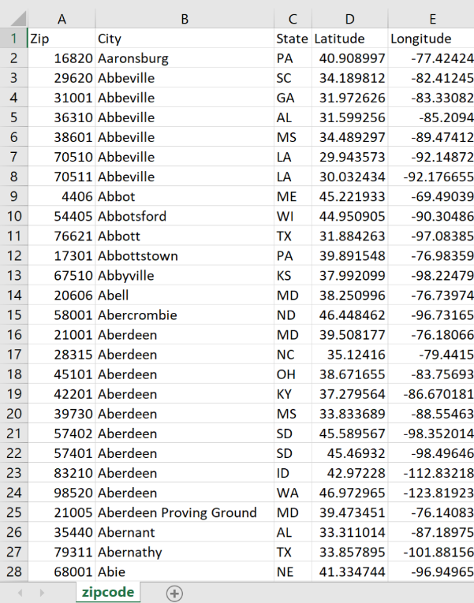  

(Please note that files in this repository have been generally
modified for code functionality. Be sure to use the associated files in
 this repository when referencing their utility in the code.)  
 
---
 
<H3> Section 2: Determining our Methodology</H3>
 
Now that we have our database, lets analyze some issues we need to look into
before we proceed:
 
1. While latitude remains fairly constant over a given area, longitude
   fluctuates to a greater degree.  It should be acceptable to provide an
    average value for longitude over a given area, but we should note the
     effect on precision and the growth factor for an increase in area.

2. We have 43 thousand entries in our database, which is a lot for a SQL
  query to process.  If we only need to find locations in a small area, we
   don't need to cycle through all of these entries.
   
2. We have several formulas for calculating distance.  There are more
  accurate and less accurate ways of doing this, but the more precise the
   formula, the more elaborate it tends to be.  This can make these queries
    computationally expensive.  We need to determine an acceptable trade-off
     between precision and performance.

Lets start breaking these down in the next section.

---

<H5> Section 2a: Mathematical Parameters </H5>

Since we are building a formula that is finding distance between latitudes
and longitudes, we need to know how far each degree of latitude and
longitude actually is.  
 
The figure for latitude tends to be pretty consistent as they are
parallel lines. Lines of longitude varies to a much greater extent, because
they converge at the poles. The distance between lines would shrink as you
travel further north (or south) from the equator.
      
We can look at the range of cities and get an approximation for latitude and
longitude based on the range of our lowest and highest latitude and
longitude values.  However, this data set includes points off of the
contiguous United States, including Hawaii, Alaska, and the Virgin Islands.  
These outliers may vastly affect how we calculate our figures, so for now
, lets only stick to using **cities within the contiguous United
States.** 
  
Lets find the cities with the highest and lowest latitude values:

| Zip   	| City        	| State 	| Latitude  	| Longitude 	|
|-------	|-------------	|-------	|-----------	|-----------	|
| 33040 	| Key West    	| FL    	| 24.567593 	| -81.7566  	|
| 56711 	| Angle Inlet 	| MN    	| 49.342144 	| -95.03571 	|

We can use [csgnetwork.com](http://www.csgnetwork.com/degreelenllavcalc.html) 
to find the length of degrees in latitude for a given latitude: 

|  Latitude 	| Length Of A Degree Of Latitude(Statute Miles) 	|
|:---------:	|:---------------------------------------------:	|
| 24.567593 	|                     68.83                     	|
| 49.342144 	|                     69.11                     	|

*We will use an integer approximation of **69** as our miles per degree
 Latitude*
 
We do the same process for longitude, but we are still using the range of
latitudes. Since lines of longitude converge at the poles, our latitude value 
will determine the distance between our lines of longitude.
   
| Zip   	| City        	| State 	| Latitude  	| Longitude 	|
|-------	|-------------	|-------	|-----------	|-----------	|
| 33040 	| Key West    	| FL    	| 24.567593 	| -81.7566  	|
| 56711 	| Angle Inlet 	| MN    	| 49.342144 	| -95.03571 	|

We use the same resource as above, 
[csgnetwork.com](http://www.csgnetwork.com/degreelenllavcalc.html),
which also provides the length of a degree of longitude for a given latitude
 
|  Latitude 	| Length Of A Degree Of Longitude(Statute Miles) 	|
|:---------:	|:----------------------------------------------:	|
|  48.35306 	|                      46.05                     	|
| 44.904789 	|                      49.07                     	|
  
There's quite a bit of variation here. It is interesting to note that the
contiguous United States consists of four time zones, and the statute mile
length may correlate with those timezones.  If true, this could be
implemented in the formula.  

For now, if we have to use one approximation, which one will we use? 
We could look at the range of longitudes highest and lowest *longitude* values 
in the United States, then determine their degree separation and miles
separation.  Dividing total miles by degree separation should give us the
miles per degree that we are looking for.
  
| City     	| State 	| Latitude  	| Longitude  	|
|----------	|-------	|-----------	|------------	|
| Neah Bay 	| WA    	| 48.35306  	| -124.64076 	|
| Eastport 	| ME    	| 44.904789 	| -66.990529 	| 
  
By putting these coordinates into 
[Movable Type Scripts](https://www.movable-type.co.uk/scripts/latlong.html),
we get a distance of 4314 km, or 2680.6 miles

Lets find the difference between our longitudes

>  

And divide the total distance in miles by the longitude degree difference to
find our approximate miles per degree.

 

*We will use a whole integer value of **46** for miles per degree Longitude*

  

---

<H5> Section 2b: Creating a Grid Structure </H5>

We have 43 thousand entries in our database, which is a lot for a SQL
query to process.  If we only need to find locations in a small area, we
don't need to cycle through all of these entries.

First of all, we need to determine how we actually get all of the points
within a given circle.  But the big issue still remains: our server calculates
the distance between our reference point to *every point in the database*.

We obviously don't need to do this.  If I'm in New York and want to find
everything within 5 miles of me, I don't need the server to find out if
locations in Kansas match my parameters.  We need to work on a
method of filtering out those results.  After that, we can apply our
circle formula to that restricted area.

To do this, lets illustrate.
Think of a Cartesian Plane with a scale of 1 mile. 
I am in City A at coordinates (0,0)

   
 
I want to find everything within a 5 mile radius, so we'll draw a circle of
radius 5 on this graph.  We'll also plot some other locations for other cities.
 
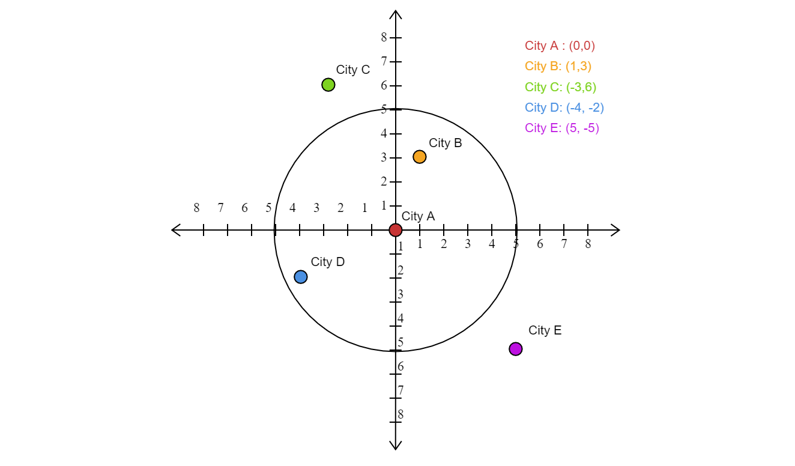

This is a neat way of finding out where our points lie.  But it is easy to
tell from a human perspective that we don't need to actually measure the
distance to City E or City C.  But our program will do it anyway because we
didn't set any limitations to tell it how far to look.
 
Now we could look for points that satisfy the range of maximum and minimum
latitudes and longitudes for the given radius.  This gives us a nice square
area to work with that completely includes the circle.  But we do get a false
positive:
  
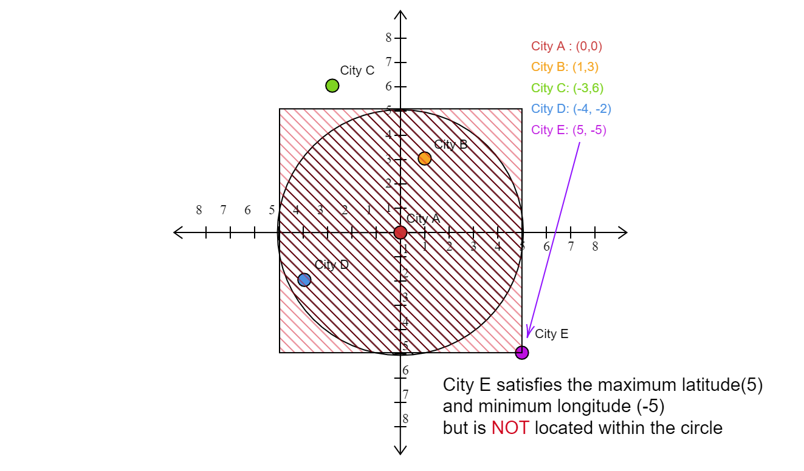  
 
 So what we want to do is exclude that red area, the area in the square that
 does not include the circle. 
 
 Our SQL Query would be structured something like the following:
 - JOIN points ON area within the square
 - WHERE these points are within the circle
 
Now we need to figure out how to relate the points to each other, with some kind
of indexing system so that our query can easily determine what parameters
to look for. 
  
What if we use a **grid system?** Lets overlay this on our figure
 
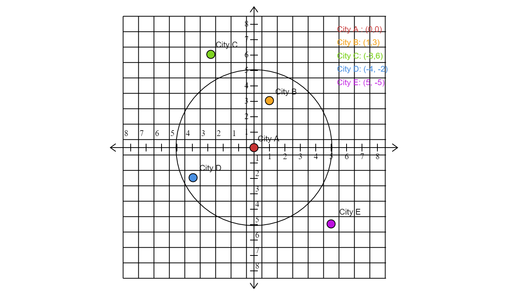  
   
Now we can give this grid some kind of numbering system, so that each point
 in the system has some *gridX coordinate and gridY coordinate*

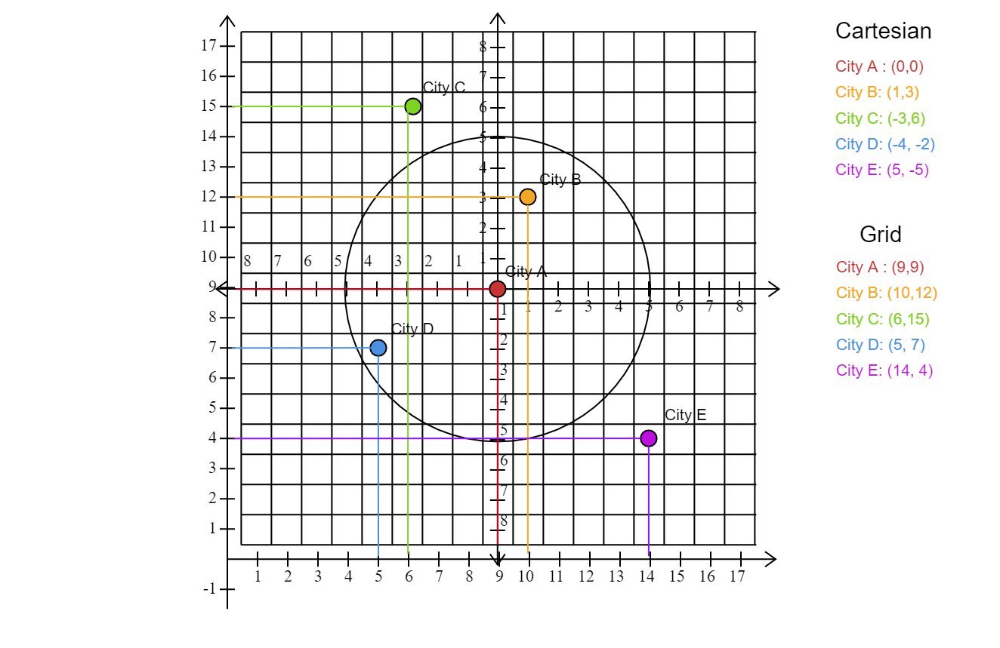  

Our system now has something to reference the points against each other.  It
knows that City B is one square right and three squares above City A.
 
So now we have a way for our query to relate data to each other and find
points within the 10x10 square.  We can now combine this with our
circle formula to find results within the radius.
  
Again, we will use our two-dimensional Euclidean distance formula. Using the
Pythagorean Theorem, the squared distance between the points equals the
sum of the latitude difference squared and longitude difference squared.
  
  
 
We need to factor in the weights of our latitude and longitude degrees in
miles to this equation.
 
   
  
Instead of solving for the square root, we could simply make a sequel query
bound our SQL parameter to be less than our *squared* target distance.  For
example, if we want to limit results to 100 miles, our distance squared
would have to be less than 100 squared.

The formula would look something like this in a SQL context:

 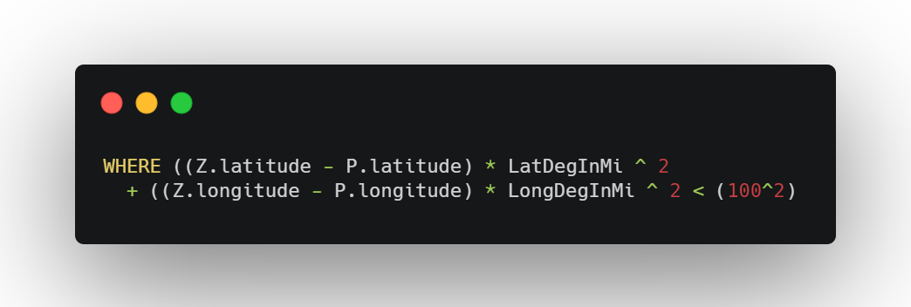  

<H5> Section 2c: Applying the Grid to our Data Set </H5>

Now that we've looked at this grid structure on a small scale, its time to
 expand it and push it up to the much larger scale of the contiguous United
  States so that we can incorporate it with our data set.
  
 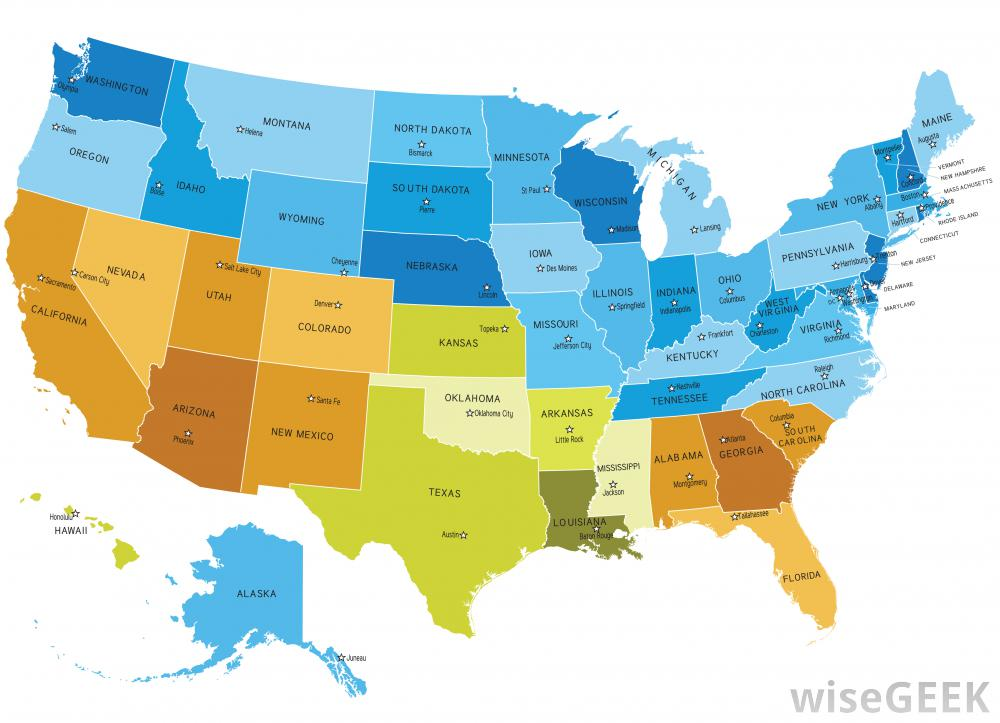    
<H6>Source: www.wisegeek.com</H6>

Lets start by defining how big we want our grid squares to be.  We'll start
 with a **20x20** definition. This should be big enough to capture a good
  representation of city area, but small enough to not overwhelm our database.
  
Next, we should try to figure out how many squares we will have on our grid.
Let's bring up our data from before.

| City        	| State 	| Latitude  	| Longitude 	|
|-------------	|-------	|-----------	|-----------	|
| Key West    	| FL    	| 24.567593 	| -81.7566  	|
| Angle Inlet 	| MN    	| 49.342144 	| -95.03571 	|

|   City   	| State 	|  Latitude 	|  Longitude 	|
|:--------:	|:-----:	|:---------:	|:----------:	|
| Neah Bay 	|   WA  	|  48.35306 	| -124.64076 	|
| Eastport 	|   ME  	| 44.904789 	| -66.990529 	|

[Movable Type Scripts](https://www.movable-type.co.uk/scripts/latlong.html)
gives us a NS distance of approximately 1711 miles and an EW distance of 
approximately 2680 miles. 

  
 
If we divide the total distances by the grid length, we should be able to
 figure out how many squares we have in our grid.
  
  

Now, we need to figure out how we index our latitude and longitudes.
Let's figure out the range of the minimum and maximum values.

  

As a reminder, lets bring up our calculated latitude and longitude miles per
 degree:

  

How do we normalize our data?

Let's look at latitude first.  Our range is 24.774551

We know that a degree of latitude is 69 miles. 
So the distance between 24.567593 and 25.567593 (1°) is 69 miles.

We figured out that our grid system has 86 squares by taking the range of
maximum and minimum values (1711) and dividing that by 20.
So our range for gridX is 1 to 86

Therefore we *also* need to divide our MilesPerDegreeLatitude by 20 to see
 where our coordinate lies on this scale of 1 to 86.

  

To determine the gridX value, we want to take the relative position of the
latitude factor and multiply it by our grid factor.
We take the difference of the latitude for a given point and
the minimum latitude to determine its relative position.  

 

We multiply it by our calculated factor to determine its gridX value.
Before we proceed though, there is an issue if we calculate for the actual
minimum value.  We would get a result of 0. So we actually want use *.000001
less than the minimum latitude* for calculation, so that minimum values
fall within the first square.
 
 

Now we can multiply by that grid factor to determine our gridX value.

 

We do the same process for longitude.  


  
 

To test this, if we put in our maximum latitude and longitude values, we
 should get results close to our values for NSSquares and EWSquares.
 
 
 
 
The formula for excel should look something like this, replacing for the
appropriate columns and hard-coding values (such as min lat/long) as necessary.

**gridX**
```  
=ROUNDUP((latitude - min lat) * (latDegInMi/gridParamMi), 0)
```

**gridY** 
```
=ROUNDUP((longitude - min long) * (longDegInMi/gridParamMi), 0)
```

---

<H2> Part 2: Code Walkthrough </H2>

<H3> Section 3: Building our SQL query </H3>

Before we build our query, lets look at our problem again:

We want to find cities within a certain radius of a given zip code.

It may be best to keep two databases, so that we can take one zip code from the first database and compare it to the cities in the second database.
We will create a new database points.csv and which will contain the same exact
information from zipcodes.csv.

Then we can use a JOIN to select our desired points.

Lets start by getting the columns we need from **zipcodes**

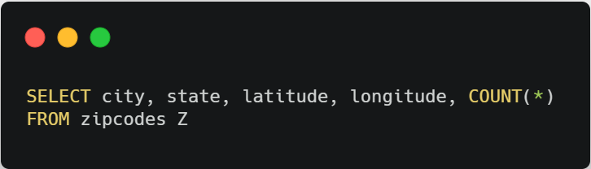

And now we join **points** on our GridX and GridY values

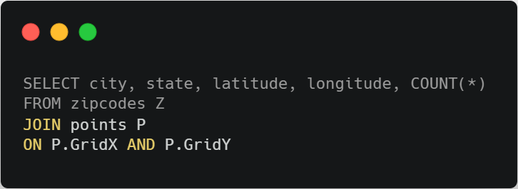 

In the above section, we built our index of gridX and gridY values based on
20 mile by 20 mile squares.  That way, if we want to find all coordinates
within a certain distance from the origin, lets say 100 miles, we can find all
gridX and gridY coordinates that are +/- 5 from that original gridX and gridY
This will define that square that encompasses the circle of radius 100 miles

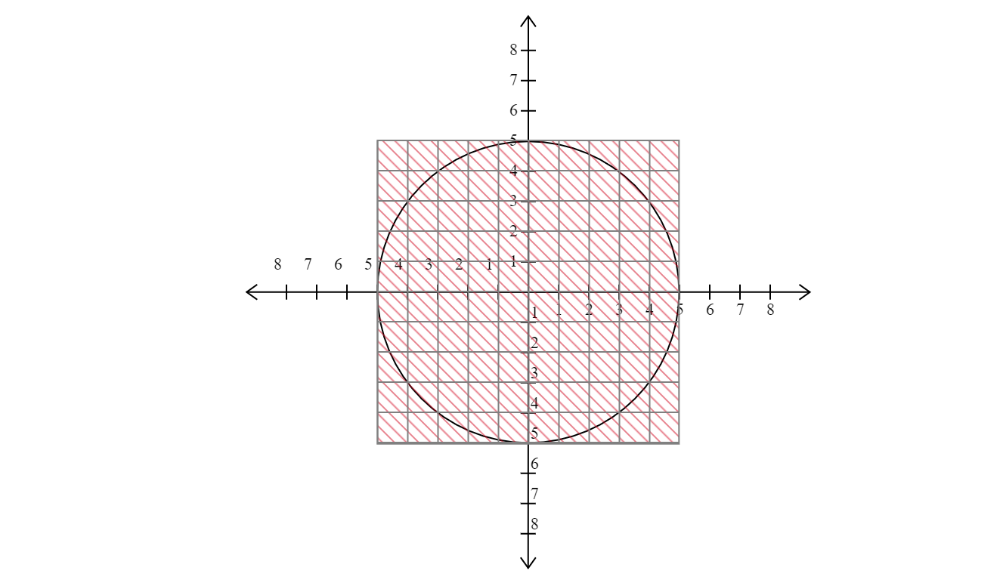 

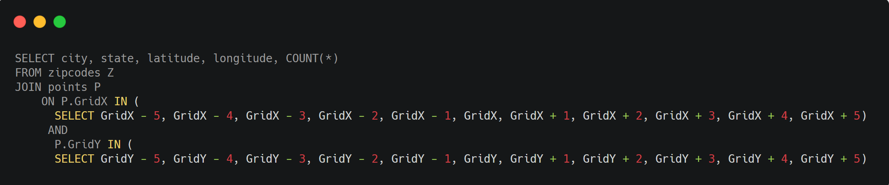 

We want to make sure that we are selecting the GridX and GridY coordinates
where the *zipcode* from **points** matches the *zipcode* from **zipcodes**

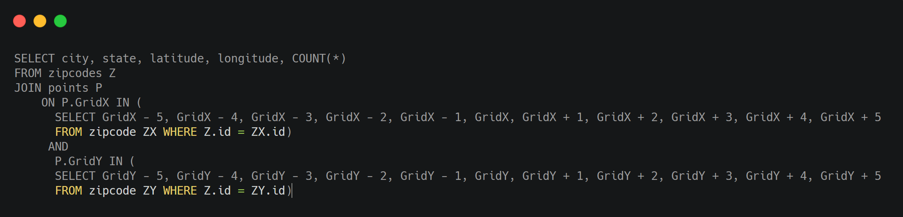 

The second part to our query involves filtering out the +/-5 GridX and
 GridY coordinates that **only** fit in the circle
 
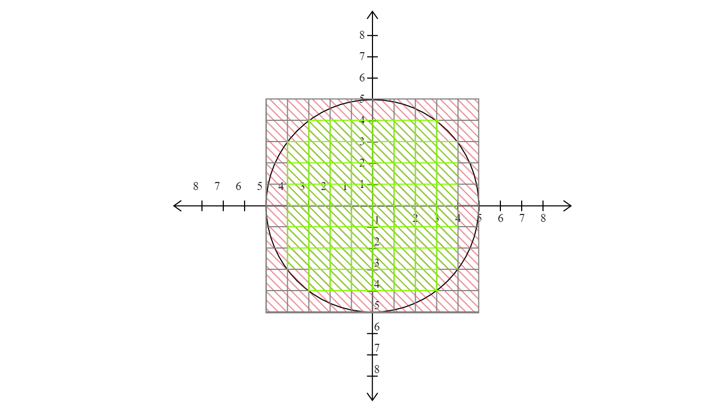

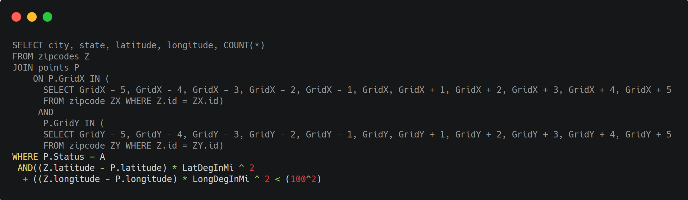

We add a GROUP BY for reading our results, and the full query looks like this:

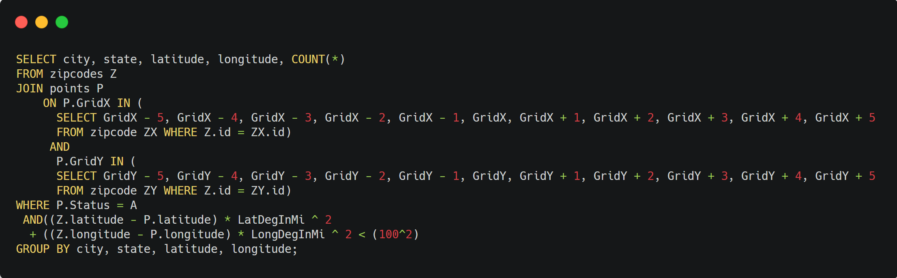 

---

<H3> Section 4: Using our code in Spark (in progress) </H3>

We have quite a lot of data, and this list is ever expanding and updating
when new cities are added and when coordinates are updated for accuracy. 
 
We may want to implement databases that contain many more data points, such
as the locations of all gas stations within the United States.  These
databases can balloon in size, and if we run our query on a basic structure
, it may either take a very long time to return results or simply crash on us
 if it cannot handle the load.  
 
We can implement Apache Spark, which uses the Resilient Distributed Dataset
, or RDD, to analyze data on a much sturdy and large scale.  SparkSQL is an
extension on top of Apache Spark that allows us to treat these RDDs like
data frames.  

Besides giving us the ability to run SQL-like queries on our
data, it also has functionality to read and write to JSON, Hive, and parquet
, and can communicate with JDBC/ODBC and Tableau. This will be handy with an
eventual React Native implementation.

---

<H4> Section 4a: Creating our Spark Session  </H4>

First, we need to create a **context** to work with SparkSQL.


We will also import the **Row** object from **pyspark.sql** to utilize in our
 code, as well as the **collections** library

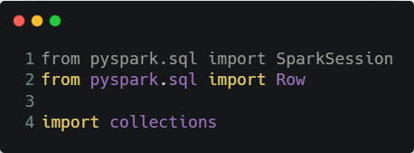

Now, we are going to create a **Spark Session**.  We will name it *spark*, and 
add on the appropriate parameters to get this to work.

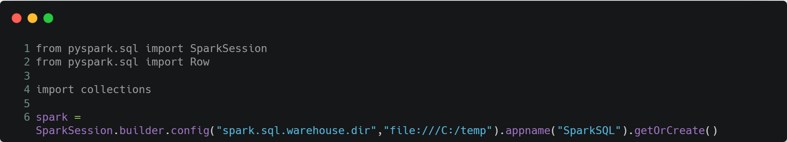

By doing this, we have a **SQL Context** on top of a Spark Context(which we
 will create later) to work with so that we can issue SQL queries against our
  database.
 
We give it an app name of **SparkSQL**
 
and we call **getOrCreate()** to start this off.

>**IMPORTANT NOTE:** The .config section is necessary only for Windows users
. It is a workaround for a bug in Spark 2.0.  If you are not on Windows,
go ahead and remove the highlighted section.
>
>
>
>The remaining code should look like this:
>
>
>
>The examples will leave out the .config section for readability. If you are
> implementing this yourself, be sure to adjust your code appropriately.
>
>**If you are on Windows, make sure you have a C:/temp folder on your hard
> drive.** If you need to point this code to go to another directory, then
> adjust this part of the code as necessary.

_____
<H5> Section 4b: Mapping our Data  </H5>
 
The .csv extension in *zipcodes.csv* stands for *comma separated values*, so its
 essentially just a large chunk of text. Our programs cannot infer how to
  separate this data into columns and rows, so we need to impart some
   structure into this.
 
Here is what we need to do:
1. Open up the text file
2. Give that text file to a mapper
3. Have the mapper convert that text file into row objects

First, we need to call the method **SparkContext** on the SparkSession
 object we created earlier named *spark*

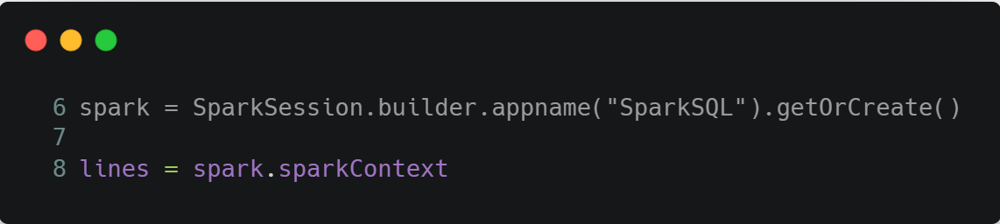

We also need to load in our data, so we call **.textfile** with the filename
 on this method too.
 
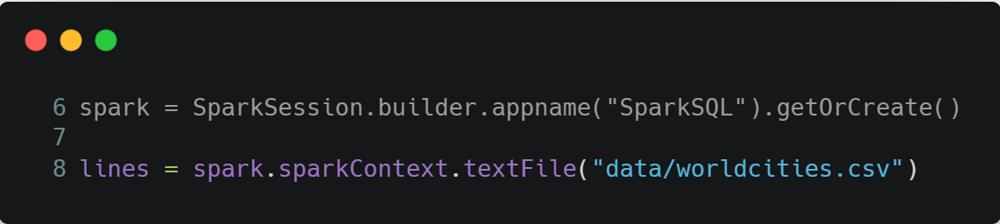

Now that we did that, we write a function to pass this onto our mapper and
 call it *places*

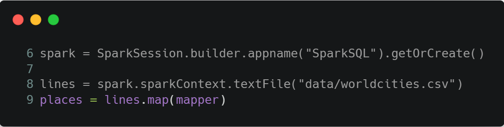

But before we proceed, we need to define what our mapper actually does.

Since we have comma separated values, our mapper needs to *split up
 each line by commas*
 
 And it needs to create *row objects*. It does this for the following:
 
 - An **ID** Column that consists of the *integer* of the city ID
 
 - A **name** column that consists of a *string* of the city name
 
 - A **lat** column that consists of a *float* of the city's latitude in
  Decimal Degrees format
  
 - A **long** column that consists of a *float* of the city's longitude in
  Decimal Degrees format

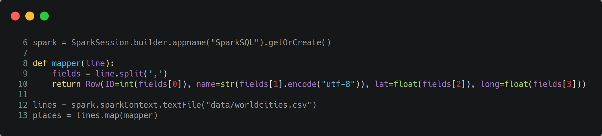

<H2> Appendix: Citations </H2>

https://stackoverflow.com/questions/1751698/sql-query-for-total-points-within-radius-of-a-location/1751760#1751760

Credit to mjv on Stack Overflow for the SQLQuery code and breakdown.